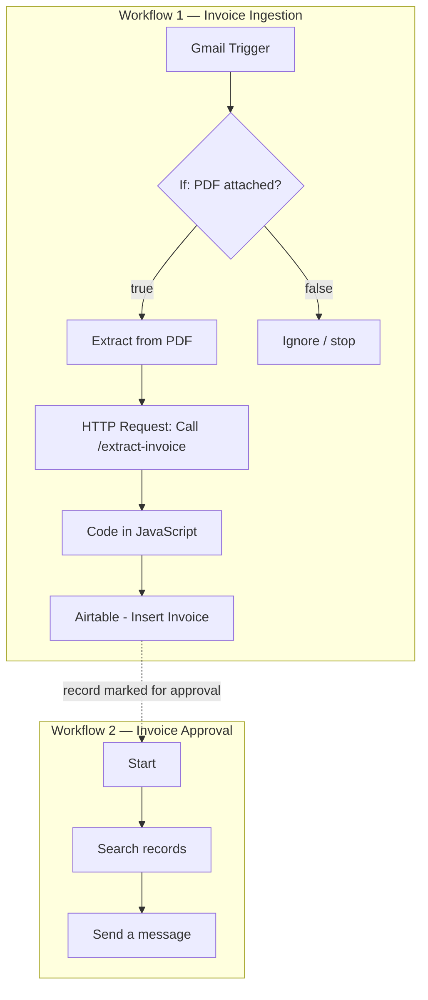

<!--
  Round 3 · Task 1 — AI Engineer Assignment
  AI Invoice Automation Workflow
-->

# 📄 AI Invoice Automation Workflow

> An end-to-end, AI-powered pipeline that turns invoice emails into clean, approved database records — with a human in control of the final decision.

**Round 3 · Task 1 — AI Engineer Assignment**

Suppliers send invoices by email as PDF attachments. This system automatically detects those
emails, reads the PDF, extracts structured data with an LLM, stores a clean record, and routes
each invoice through a human approval step — keeping people in control of the final approval.

---

## Table of Contents

1. [Architecture](#architecture)
2. [Tech Stack](#tech-stack)
3. [Key Features](#key-features)
4. [Repository Structure](#repository-structure)
5. [Prerequisites](#prerequisites)
6. [Environment Variables](#environment-variables)
7. [Setup & Run](#setup--run)
8. [Workflow Explanation](#workflow-explanation)
9. [AI Prompt](#ai-prompt)
10. [Database Schema](#database-schema)
11. [Error Handling & Edge Cases](#error-handling--edge-cases)
12. [Security](#security)
13. [Assumptions](#assumptions)
14. [Future Improvements](#future-improvements)

---

## Architecture

The solution is composed of **two n8n workflows**, a lightweight **FastAPI + Gemini**
extraction microservice, and **Airtable** as the system of record.



**Workflow 1 — Invoice Ingestion:**
`Gmail Trigger → If → Extract from PDF → HTTP Request (Call /extract-invoice) → Code in JavaScript → Airtable - Insert Invoice`

**Workflow 2 — Invoice Approval:**
`Start → Search records → Send a message`

**Why a separate FastAPI service?** Keeping the AI extraction in its own Python service (rather
than inline JavaScript) makes the prompt, model, and post-processing easy to test, version, and
swap — and keeps the n8n workflow clean and readable.

---

## Tech Stack

| Layer          | Technology                                                        |
|----------------|-------------------------------------------------------------------|
| Orchestration  | **n8n** (self-hosted via Docker)                                  |
| AI / LLM       | **Google Gemini** (`gemini-2.5-flash-lite`) via `google-generativeai` |
| Backend        | **FastAPI + Python** (plain Python, no LangChain)                 |
| Database       | **Airtable**                                                      |
| PDF extraction | n8n **Extract from PDF** node                                     |
| Email          | **Gmail** (OAuth2, via n8n)                                       |

---

## Key Features

- 📥 **Smart email intake** — processes only PDF-attachment emails; anything else is safely ignored.
- 🤖 **AI extraction** — Gemini returns strict, structured JSON for every invoice field.
- 🧹 **Robust cleaning** — safe JSON parsing, default-filling, numeric validation, empty-item removal.
- 🗂️ **Full audit trail** — status transitions and `Approved At` timestamp on every record.
- 👤 **Human-in-the-loop approval** — a person makes the final Approve / Reject call.
- 🛡️ **Graceful error handling** — the pipeline never breaks on malformed or non-invoice input.

---

## Repository Structure

```
Anthrasync-Assistant/
├── invoice_api.py               # FastAPI service exposing /extract-invoice
├── src/                         # supporting Python modules (generator, config, api)
├── n8n-workflows/
│   ├── invoice_ingestion.json   # Workflow 1
│   └── invoice_approval.json    # Workflow 2
├── invoice_columns.csv          # Airtable schema reference
├── sample_invoice.pdf           # sample invoice used for testing
├── requirements.txt
├── .env.example
└── README.md
```

> Workflow JSONs are exported directly from the running n8n instance
> (Workflow → `⋯` → **Download**) so they match the live nodes exactly.

---

## Prerequisites

- Python 3.10+
- Docker Desktop (for n8n)
- A Google Gemini API key
- An Airtable base (schema in [Database Schema](#database-schema))
- A Gmail account for the trigger and notifications

---

## Environment Variables

Create a `.env` file in the project root (template: `.env.example`):

```env
GEMINI_API_KEY=your_gemini_api_key_here
```

Credentials configured **inside n8n** (never in the repo):

- **Gmail** — OAuth2 credential (Gmail Trigger + Send nodes)
- **Airtable** — Personal Access Token (PAT) credential

---

## Setup & Run

**1. Clone & install**

```bash
git clone https://github.com/Akhil-60/Anthrasync-Assistant.git
cd Anthrasync-Assistant
python -m venv venv
venv\Scripts\activate          # Windows
pip install -r requirements.txt
```

**2. Configure** — copy `.env.example` to `.env` and add your `GEMINI_API_KEY`.

**3. Start the extraction service**

```bash
uvicorn invoice_api:app --host 0.0.0.0 --port 8000 --reload
```

Check `http://127.0.0.1:8000/docs`.

**4. Start n8n**

```bash
docker run -d --name n8n -p 5678:5678 -v n8n_data:/home/node/.n8n n8nio/n8n:latest
```

Open **`http://127.0.0.1:5678`**.

> On Windows, use `127.0.0.1` rather than `localhost` to avoid `ERR_CONNECTION_RESET`.

**5. Import** both files from `n8n-workflows/`, **configure** the Gmail + Airtable credentials,
and **activate** the ingestion workflow. n8n reaches the API at
`http://host.docker.internal:8000/extract-invoice`.

---

## Workflow Explanation

### Workflow 1 — Invoice Ingestion

| # | Node | Purpose |
|---|------|---------|
| 1 | **Gmail Trigger** | Polls the inbox; captures email metadata (sender, subject, received time). |
| 2 | **IF (PDF filter)** | Passes only emails with a PDF attachment. Non-PDF emails hit the empty `false` branch and are ignored — the workflow never breaks. |
| 3 | **Extract from PDF** | Extracts raw text from the attached PDF. |
| 4 | **HTTP Request** | `POST`s the text to FastAPI `/extract-invoice`. |
| 5 | **Code (JS)** | Parses & cleans the JSON, maps fields to Airtable column names, fills safe defaults. |
| 6 | **Airtable — Create** | Writes the record with `Application Status = Draft`, `Send for Approval = false`. |

### Workflow 2 — Invoice Approval

| # | Node | Purpose |
|---|------|---------|
| 1 | **Trigger** | Manual or scheduled. |
| 2 | **Airtable — Search** | Finds `Send for Approval = true` **AND** `Application Status = Draft`. |
| 3 | **Gmail — Send** | Emails the approver a summary (vendor, invoice #, gross amount). |
| 4 | **Human decision** | Approver sets `Application Status → Fully Approved / Rejected` and fills `Approved At`. |

---

## AI Prompt

The FastAPI service instructs Gemini to return **valid JSON only**:

```text
You are an invoice data extraction engine. Read the invoice text below and return a SINGLE
valid JSON object — no markdown, no commentary, no code fences.

Extract these fields (use null when a value is not present):
vendor, vendorUid, vendorIban, invoiceNumber, invoiceDate (YYYY-MM-DD),
dueDate (YYYY-MM-DD), netAmount, vatAmount, vatPercentage, grossAmount,
currency, costCenter, lineItems (array of {description, quantity, unitPrice, amount}),
confidenceScore (0.0-1.0), anomalies (array of strings for anything inconsistent,
e.g. gross != net + vat).

Rules:
- Numeric fields must be numbers, not strings.
- Dates must be ISO format (YYYY-MM-DD).
- If the document is not an invoice, set confidenceScore low and note it in anomalies.
- Return ONLY the JSON object.

Invoice text:
"""
{invoice_text}
"""
```

> The exact prompt lives in `src/generator.py`.

---

## Database Schema

| Column               | Type                | Description                        |
|----------------------|---------------------|------------------------------------|
| Vendor               | Single line text    | Vendor name                        |
| Vendor UID           | Single line text    | Vendor identifier                  |
| Vendor IBAN          | Single line text    | Vendor bank account                |
| Invoice Number       | Single line text    | Invoice number                     |
| Invoice Date         | Date                | Invoice issue date                 |
| Due Date             | Date                | Payment due date                   |
| Net Amount           | Number              | Net invoice amount                 |
| VAT Amount           | Number              | VAT amount                         |
| VAT %                | Number              | VAT percentage                     |
| Gross Amount         | Number              | Total invoice amount               |
| Currency             | Single line text    | Invoice currency                   |
| Cost Center          | Single line text    | Cost center                        |
| Line Items           | Long text           | Extracted items (JSON array)       |
| Confidence           | Number              | AI confidence score                |
| Anomalies            | Long text           | Extraction warnings                |
| Application Status   | Single select/text  | Draft / Fully Approved / Rejected  |
| Selected Departments | Multiple select     | One or more departments            |
| Send for Approval    | Single line text    | Flag (`true` / `false`)            |
| Source               | Single line text    | Source channel (e.g. "Email")      |
| Sender               | Single line text    | Sender information                 |
| Sender Email         | Single line text    | Sender email address               |
| Sender Name          | Single line text    | Sender display name                |
| Email Subject        | Single line text    | Email subject line                 |
| Email Received       | Checkbox            | Whether the email was received     |
| Received At          | Date & time         | Email received timestamp           |
| PDF Attachment       | Attachment          | Original invoice PDF               |
| Approved At          | Date & time         | Audit — when the status was set    |

---

## Error Handling & Edge Cases

- **Non-PDF emails** are filtered by the IF node (empty `false` branch = ignore).
- **Malformed AI output** — the API fills safe defaults for every field and, on exception,
  returns a valid JSON object with the error captured in `anomalies`, so downstream nodes always
  receive well-formed data.
- **Empty line items** are dropped during cleaning.
- **Confidence & anomalies** are stored on each record to support human review.

---

## Security

- Secrets (Gemini key, Airtable PAT, Gmail OAuth) live only in `.env` (git-ignored) and n8n's
  encrypted credential store — never in the repo.
- `.env.example` documents required variables without values.
- Any credential exposed during development is regenerated.

---

## Assumptions

- **Approval mechanism** — the Approve / Reject decision is a manual Airtable status update, for
  reliability. In production this can be fully automated with n8n's **Send and Wait for Response**
  node (email Approve/Reject buttons that resume the workflow).
- **PDF storage** — the `PDF Attachment` field holds the original PDF; in production the workflow
  uploads it to object storage (Drive / S3) and stores the resulting URL, since Airtable accepts
  attachments by URL.
- **Single attachment** per email (`attachment_0`) is assumed.
- **Windows networking** — `127.0.0.1` / `host.docker.internal` are used to avoid `localhost`
  resolution issues.

---

## Future Improvements

- Full email-button approval via Send-and-Wait (automatic status update on click).
- Automatic PDF upload to object storage with URL write-back.
- Duplicate-invoice detection and vendor master validation.
- OCR fallback for scanned (image-only) PDFs.
- Confidence-based routing (auto-approve high-confidence, human-review low-confidence).
- Slack / Teams approval notifications.
